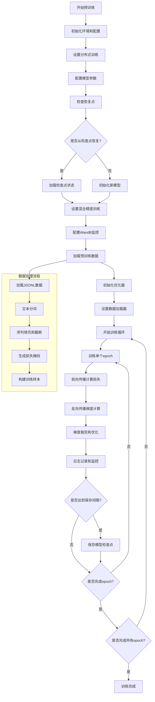
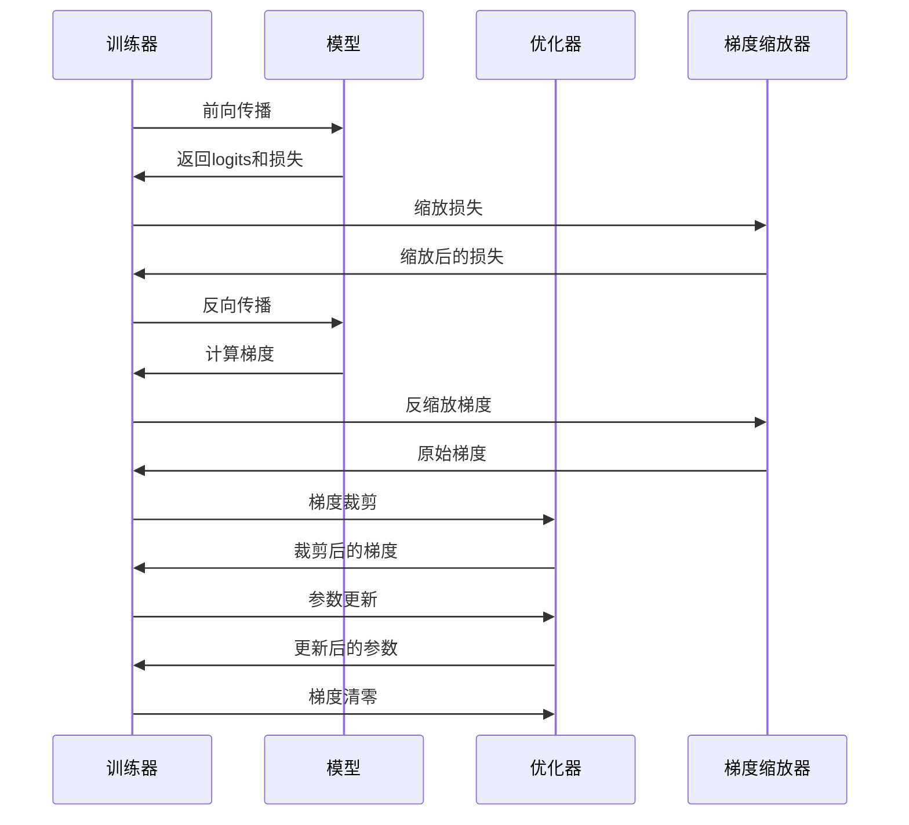

# MiniMind 预训练流程分析

## 概述
MiniMind项目的预训练流程是一个完整的语言模型预训练系统，支持从零开始训练或基于现有权重继续训练。该流程采用标准的因果语言模型预训练方法，通过自回归方式预测下一个token来学习语言表示。

## 预训练流程图



## 详细训练步骤

### 1. 环境初始化阶段

**关键配置参数：**
- `--epochs`: 训练轮数（默认1轮，建议1轮zero或2-6轮充分训练）
- `--batch_size`: 批次大小（默认32）
- `--learning_rate`: 初始学习率（默认5e-4）
- `--hidden_size`: 隐藏层维度（默认512）
- `--num_hidden_layers`: 隐藏层数量（默认8）
- `--max_seq_len`: 最大序列长度（默认512）

**初始化步骤：**
1. **分布式训练初始化**：支持多GPU分布式数据并行训练
2. **随机种子设置**：确保训练可复现性
3. **目录配置**：创建模型保存目录
4. **模型参数配置**：根据MiniMindConfig配置模型架构

### 2. 数据准备阶段

**数据源：**
- 默认数据路径：`../dataset/pretrain_hq.jsonl`
- 数据格式：JSONL格式，每行包含`{"text": "文本内容"}`

**数据处理流程：**
```python
class PretrainDataset(Dataset):
    def __getitem__(self, index):
        # 1. 加载文本数据
        text = self.samples[index]['text']
        
        # 2. 分词和编码
        encoding = self.tokenizer(
            text, 
            max_length=self.max_length,
            padding='max_length',
            truncation=True
        )
        
        # 3. 生成损失掩码（仅对非填充token计算损失）
        input_ids = encoding.input_ids.squeeze()
        loss_mask = (input_ids != self.tokenizer.pad_token_id)
        
        # 4. 构建训练样本（X: 输入序列, Y: 目标序列）
        X = input_ids[:-1]  # 前n-1个token
        Y = input_ids[1:]   # 后n-1个token
        
        return X, Y, loss_mask[1:]
```

### 3. 训练循环阶段

**单个训练步骤流程：**



**关键训练组件：**

1. **混合精度训练**：支持bfloat16和float16
2. **梯度累积**：通过`--accumulation_steps`控制
3. **梯度裁剪**：防止梯度爆炸
4. **学习率调度**：余弦退火调度策略

### 4. 监控和保存阶段

**日志记录：**
- 每`--log_interval`步记录训练状态
- 实时显示损失、学习率、预计完成时间
- 可选WandB集成监控

**模型保存：**
- 每`--save_interval`步保存检查点
- 支持半精度模型权重保存
- 保存完整的训练状态用于恢复

## 技术特点

### 1. 分布式训练支持
- 自动检测分布式环境
- 支持多GPU数据并行
- 智能检查点恢复机制

### 2. 灵活的配置系统
- 命令行参数驱动
- 支持模型架构自定义
- 可配置的训练参数

### 3. 高效的训练优化
- 混合精度训练加速
- 梯度累积减少内存占用
- 智能的数据加载策略

### 4. 完整的监控体系
- 实时训练状态监控
- 可视化工具集成
- 详细的日志记录

## 使用示例

### 基本预训练命令
```bash
python trainer/train_pretrain.py \
    --epochs 2 \
    --batch_size 32 \
    --learning_rate 5e-4 \
    --hidden_size 512 \
    --num_hidden_layers 8 \
    --max_seq_len 512
```

### 分布式训练示例
```bash
torchrun --nproc_per_node=4 trainer/train_pretrain.py \
    --epochs 1 \
    --batch_size 128 \
    --learning_rate 1e-3
```

### 从检查点恢复训练
```bash
python trainer/train_pretrain.py \
    --from_resume 1 \
    --epochs 3
```

## 依赖关系

预训练流程依赖于以下关键组件：

1. **模型架构**：`model/model_minimind.py`
2. **数据处理**：`dataset/lm_dataset.py`
3. **训练工具**：`trainer/trainer_utils.py`
4. **分词器**：`model/tokenizer_config.json`

## 性能优化建议

1. **内存优化**：适当调整`batch_size`和`max_seq_len`
2. **训练速度**：使用混合精度和梯度累积
3. **收敛效果**：根据数据量调整`epochs`和`learning_rate`
4. **分布式训练**：多GPU训练可显著加速

## 总结

MiniMind的预训练流程是一个设计完善、功能齐全的语言模型训练系统。它结合了现代深度学习的最佳实践，提供了灵活的配置选项和高效的训练策略。该流程为后续的微调阶段（SFT、DPO、PPO等）奠定了坚实的基础模型。