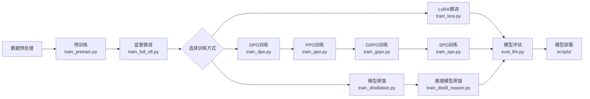

# MiniMind 项目结构分析

## 项目概述

MiniMind 是一个从零开始构建的极简语言模型项目，旨在用最低成本（3元 + 2小时）训练出25.8M的超小语言模型。项目包含完整的LLM训练流程，从预训练到强化学习训练的全过程。

## 项目架构流程图

```mermaid
graph TB
    subgraph "项目根目录"
        ROOT[项目根目录] --> DOCS[文档文件]
        ROOT --> DATASET[数据集模块]
        ROOT --> MODEL[模型模块]
        ROOT --> TRAINER[训练器模块]
        ROOT --> SCRIPTS[脚本工具]
        ROOT --> IMAGES[图片资源]
    end

    subgraph "文档文件"
        DOCS --> README[README.md - 项目说明]
        DOCS --> README_EN[README_en.md - 英文说明]
        DOCS --> LICENSE[LICENSE - 许可证]
        DOCS --> CODE_OF_CONDUCT[CODE_OF_CONDUCT.md - 行为准则]
    end

    subgraph "数据集模块 /dataset"
        DATASET --> DATASET_INIT[__init__.py]
        DATASET --> DATASET_MD[dataset.md - 数据集说明]
        DATASET --> LM_DATASET[lm_dataset.py - 语言模型数据集]
    end

    subgraph "模型模块 /model"
        MODEL --> MODEL_INIT[__init__.py]
        MODEL --> MODEL_MAIN[model_minimind.py - 主模型架构]
        MODEL --> MODEL_LORA[model_lora.py - LoRA模型]
        MODEL --> TOKENIZER[分词器配置]
    end

    subgraph "训练器模块 /trainer"
        TRAINER --> TRAINER_UTILS[trainer_utils.py - 训练工具]
        TRAINER --> PRETRAIN[train_pretrain.py - 预训练]
        TRAINER --> SFT[train_full_sft.py - 监督微调]
        TRAINER --> LORA[train_lora.py - LoRA微调]
        TRAINER --> DPO[train_dpo.py - 直接偏好优化]
        TRAINER --> PPO[train_ppo.py - PPO强化学习]
        TRAINER --> GRPO[train_grpo.py - GRPO强化学习]
        TRAINER --> SPO[train_spo.py - SPO强化学习]
        TRAINER --> DISTILL[train_distillation.py - 模型蒸馏]
        TRAINER --> REASON_DISTILL[train_distill_reason.py - 推理模型蒸馏]
    end

    subgraph "脚本工具 /scripts"
        SCRIPTS --> CHAT_API[chat_openai_api.py - OpenAI API聊天]
        SCRIPTS --> SERVE_API[serve_openai_api.py - OpenAI API服务]
        SCRIPTS --> CONVERT[convert_model.py - 模型转换]
        SCRIPTS --> TOKENIZER_TRAIN[train_tokenizer.py - 分词器训练]
        SCRIPTS --> WEB_DEMO[web_demo.py - Web演示界面]
    end

    subgraph "核心文件"
        EVAL[eval_llm.py - 模型评估]
        REQ[requirements.txt - 依赖包]
    end

    MODEL --> EVAL
    TRAINER --> EVAL
    ROOT --> EVAL
    ROOT --> REQ

    %% 训练流程
    PRETRAIN --> SFT
    SFT --> LORA
    SFT --> DPO
    DPO --> PPO
    PPO --> GRPO
    GRPO --> SPO
    SFT --> DISTILL
    DISTILL --> REASON_DISTILL

    %% 部署流程
    MODEL --> CONVERT
    CONVERT --> SERVE_API
    SERVE_API --> CHAT_API
    SERVE_API --> WEB_DEMO

    classDef module fill:#e1f5fe,stroke:#01579b,stroke-width:2px
    classDef core fill:#f3e5f5,stroke:#4a148c,stroke-width:2px
    classDef process fill:#e8f5e8,stroke:#1b5e20,stroke-width:2px
    classDef deploy fill:#fff3e0,stroke:#e65100,stroke-width:2px

    class DOCS,MODEL,DATASET,TRAINER,SCRIPTS module
    class EVAL,REQ core
    class PRETRAIN,SFT,LORA,DPO,PPO,GRPO,SPO,DISTILL,REASON_DISTILL process
    class CONVERT,SERVE_API,CHAT_API,WEB_DEMO deploy
```

## 详细模块说明

### 1. 模型架构 (model/)
- **model_minimind.py**: 核心模型架构，包含MiniMindConfig配置类和MiniMind模型类
- **model_lora.py**: LoRA微调实现
- **分词器配置**: tokenizer.json和tokenizer_config.json

### 2. 训练流程 (trainer/)
- **预训练阶段**: train_pretrain.py
- **监督微调**: train_full_sft.py
- **LoRA微调**: train_lora.py
- **强化学习训练**: 
  - DPO (直接偏好优化): train_dpo.py
  - PPO (近端策略优化): train_ppo.py
  - GRPO (分组策略优化): train_grpo.py
  - SPO (稀疏策略优化): train_spo.py
- **模型蒸馏**: train_distillation.py
- **推理模型蒸馏**: train_distill_reason.py

### 3. 工具脚本 (scripts/)
- **模型转换**: convert_model.py
- **分词器训练**: train_tokenizer.py
- **API服务**: serve_openai_api.py
- **聊天接口**: chat_openai_api.py
- **Web演示**: web_demo.py

### 4. 数据集处理 (dataset/)
- **lm_dataset.py**: 语言模型数据集处理
- 支持多种数据格式和预处理流程

## 技术特点

1. **极简架构**: 从零实现，不依赖第三方框架抽象接口
2. **完整流程**: 覆盖预训练、微调、强化学习全流程
3. **多训练方式**: 支持SFT、LoRA、DPO、PPO、GRPO、SPO等
4. **模型蒸馏**: 支持白盒模型蒸馏
5. **兼容性**: 兼容transformers、trl、peft等主流框架
6. **部署友好**: 支持OpenAI API协议和Web界面

## 训练流程说明

## 部署流程

训练完成的模型可以通过以下方式部署：

1. **模型转换**: 使用convert_model.py转换为兼容格式
2. **API服务**: 通过serve_openai_api.py启动OpenAI兼容API
3. **Web界面**: 使用web_demo.py启动Streamlit界面
4. **第三方集成**: 支持llama.cpp、vllm、ollama等推理引擎

这个项目结构清晰，模块化程度高，非常适合学习和研究语言模型的完整训练流程。