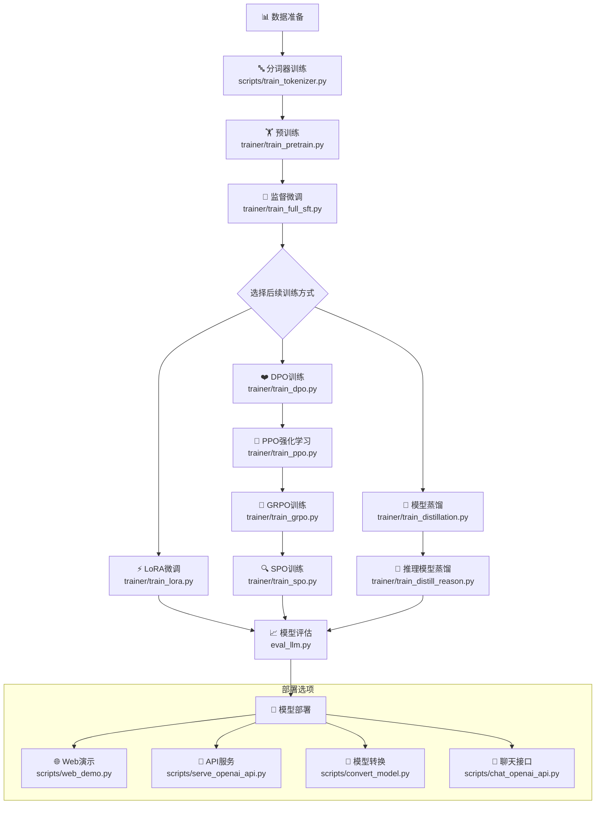
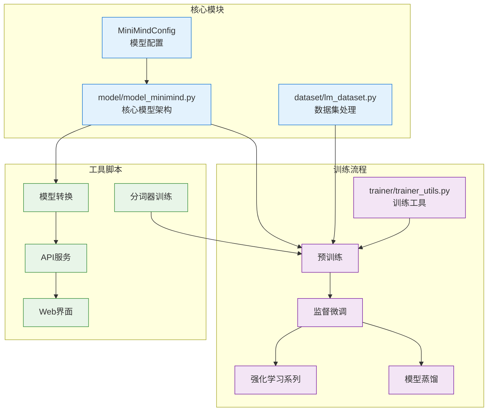
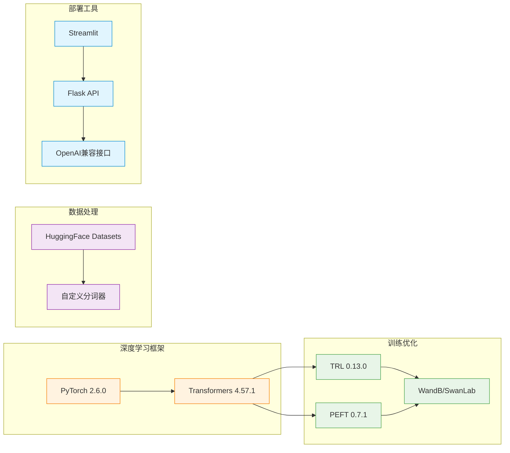

# MiniMind 项目工作流程

## 核心训练流程



## 项目模块依赖关系



## 技术栈架构



## 文件组织结构

```
minimind/
├── 📁 model/                 # 模型架构
│   ├── model_minimind.py     # 核心模型
│   ├── model_lora.py         # LoRA实现
│   └── tokenizer配置         # 分词器
├── 📁 trainer/               # 训练流程
│   ├── train_pretrain.py     # 预训练
│   ├── train_full_sft.py     # 监督微调
│   ├── train_lora.py         # LoRA微调
│   ├── train_dpo.py          # DPO训练
│   ├── train_ppo.py          # PPO强化学习
│   ├── train_grpo.py         # GRPO训练
│   ├── train_spo.py          # SPO训练
│   ├── train_distillation.py # 模型蒸馏
│   └── train_distill_reason.py # 推理蒸馏
├── 📁 scripts/               # 工具脚本
│   ├── train_tokenizer.py    # 分词器训练
│   ├── convert_model.py      # 模型转换
│   ├── serve_openai_api.py   # API服务
│   ├── chat_openai_api.py    # 聊天接口
│   └── web_demo.py           # Web演示
├── 📁 dataset/               # 数据集
│   └── lm_dataset.py         # 数据集处理
├── eval_llm.py               # 模型评估
└── requirements.txt          # 依赖管理
```

这个工作流程展示了MiniMind项目从数据准备到模型部署的完整生命周期，突出了其模块化设计和完整的训练流程支持。