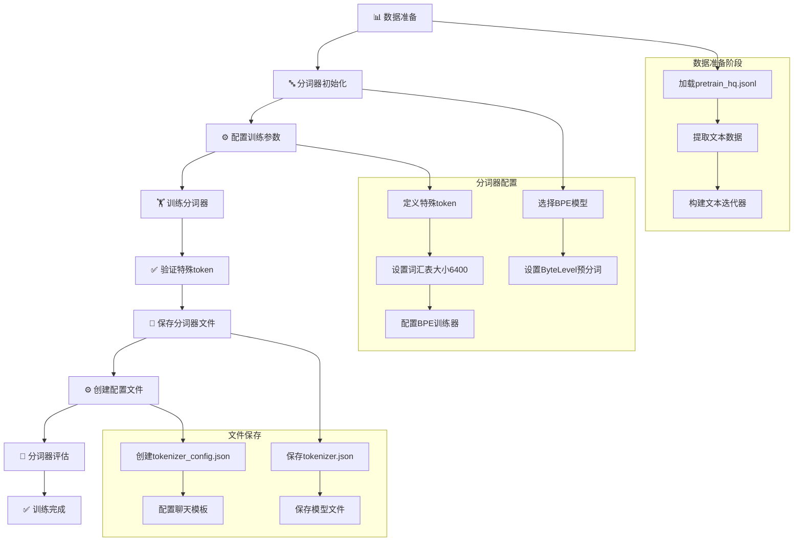
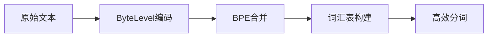
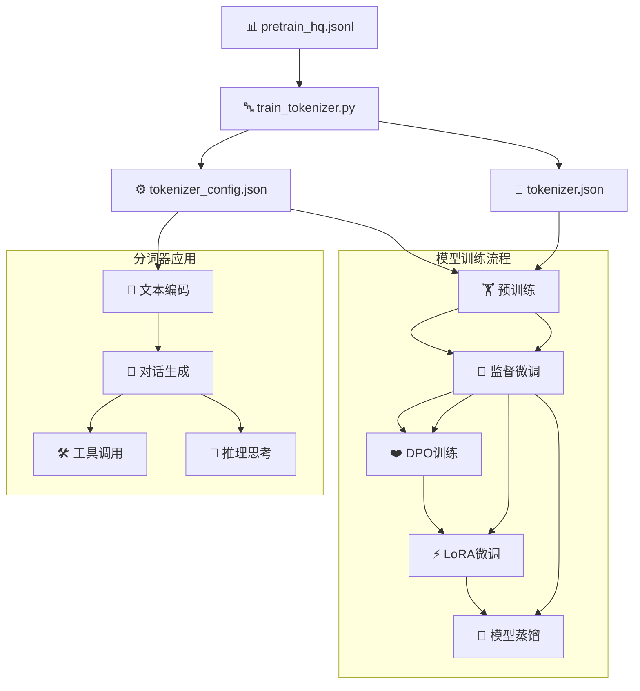

# MiniMind 分词器训练流程分析

## 概述

MiniMind项目使用自定义的BPE（Byte Pair Encoding）分词器，该分词器基于HuggingFace的`tokenizers`库从零开始训练。分词器训练是模型训练流程的第一步，为后续的预训练和微调提供基础支持。

## 分词器训练流程图



## 详细训练流程

### 1. 数据准备阶段

```python
def read_texts_from_jsonl(file_path):
    """从JSONL文件中提取文本数据"""
    with open(file_path, 'r', encoding='utf-8') as f:
        for line in f:
            data = json.loads(line)
            yield data['text']
```

**数据来源**: `../dataset/pretrain_hq.jsonl`
- 包含约1.6GB的高质量预训练语料
- 文本长度限制在512字符以内
- 数据格式为JSONL，每行包含`text`字段

### 2. 分词器初始化

```python
# 初始化BPE模型的分词器
tokenizer = Tokenizer(models.BPE())

# 设置ByteLevel预分词器
tokenizer.pre_tokenizer = pre_tokenizers.ByteLevel(add_prefix_space=False)
```

**配置说明**:
- **模型类型**: BPE (Byte Pair Encoding)
- **预分词器**: ByteLevel，处理Unicode字符
- **前缀空格**: 不添加前缀空格

### 3. 训练参数配置

```python
special_tokens = ["<|endoftext|>", "<|im_start|>", "<|im_end|>"]

trainer = trainers.BpeTrainer(
    vocab_size=6400,           # 词汇表大小
    special_tokens=special_tokens,  # 特殊token
    show_progress=True,        # 显示训练进度
    initial_alphabet=pre_tokenizers.ByteLevel.alphabet()  # 初始字母表
)
```

**关键参数**:
- **词汇表大小**: 6400个token，适合小型模型
- **特殊token**: 3个预定义的特殊标记
- **字母表**: 基于ByteLevel的Unicode支持

### 4. 训练过程

```python
# 读取文本数据
texts = read_texts_from_jsonl(data_path)

# 训练分词器
tokenizer.train_from_iterator(texts, trainer=trainer)

# 设置ByteLevel解码器
tokenizer.decoder = decoders.ByteLevel()
```

**训练特点**:
- 使用迭代器方式处理大数据集
- 支持流式训练，内存友好
- 自动学习BPE合并规则

### 5. 特殊token验证

```python
# 验证特殊token的索引
assert tokenizer.token_to_id("<|endoftext|>") == 0
assert tokenizer.token_to_id("<|im_start|>") == 1
assert tokenizer.token_to_id("<|im_end|>") == 2
```

**特殊token功能**:
- `<|endoftext|>` (索引0): 文本结束标记，同时作为pad_token和unk_token
- `<|im_start|>` (索引1): 对话开始标记，作为bos_token
- `<|im_end|>` (索引2): 对话结束标记，作为eos_token

### 6. 文件保存

```python
# 保存分词器文件
tokenizer.save(os.path.join(tokenizer_dir, "tokenizer.json"))
tokenizer.model.save("../model/")

# 手动创建配置文件
config = {
    "add_bos_token": False,
    "add_eos_token": False,
    "bos_token": "<|im_start|>",
    "eos_token": "<|im_end|>",
    "pad_token": "<|endoftext|>",
    "unk_token": "<|endoftext|>",
    "model_max_length": 32768,
    # ... 完整配置
}
```

**生成的文件**:
- `tokenizer.json`: 分词器的主要配置文件
- `tokenizer_config.json`: HuggingFace兼容的配置文件
- 模型相关文件

### 7. 聊天模板配置

分词器配置包含复杂的聊天模板，支持：
- 多轮对话处理
- 工具调用功能 (`<tool_call>`标签)
- 推理思考链 (`<thinking>`标签)
- 系统消息和用户消息区分

## 分词器技术特点

### 1. BPE算法优势


- **子词级别**: 处理未知词汇能力强
- **多语言支持**: ByteLevel处理所有Unicode字符
- **压缩效率**: 6400词汇表大小平衡了效率和性能

### 2. 特殊token设计

| Token | 索引 | 功能 | 用途 |
|-------|------|------|------|
| `<|endoftext|>` | 0 | 文本结束/Pad/Unknown | 填充、未知词处理 |
| `<|im_start|>` | 1 | 对话开始 | 标记对话开始 |
| `<|im_end|>` | 2 | 对话结束 | 标记对话结束 |

### 3. 聊天模板特性

```python
# 支持的工具调用格式
<tool_call>
{"name": "function_name", "arguments": {}}
</tool_call>

# 支持的思考链格式
<thinking>
推理过程...
</thinking>
<im_end>

# 多轮对话支持
<|im_start|>system
系统消息<|im_end|>
<|im_start|>user
用户消息<|im_end|>
<|im_start|>assistant
助手回复<|im_end|>
```

## 训练流程依赖关系



## 使用示例

### 1. 训练分词器
```bash
cd scripts/
python train_tokenizer.py
```

### 2. 加载和使用分词器
```python
from transformers import AutoTokenizer

tokenizer = AutoTokenizer.from_pretrained("../model/")

# 编码文本
encoded = tokenizer("你好，世界！")
print(encoded.input_ids)

# 应用聊天模板
messages = [
    {"role": "user", "content": "你好"},
    {"role": "assistant", "content": "你好！有什么可以帮助你的？"}
]
chat_prompt = tokenizer.apply_chat_template(messages, tokenize=False)
print(chat_prompt)
```

## 性能特点

1. **高效性**: ByteLevel预分词 + BPE合并，处理速度快
2. **兼容性**: 完全兼容HuggingFace Transformers生态
3. **灵活性**: 支持多种对话格式和工具调用
4. **轻量化**: 6400词汇表，适合资源受限环境

这个分词器训练流程为MiniMind项目的整个训练流程提供了坚实的基础，确保了模型能够正确处理中文文本和复杂的对话场景。